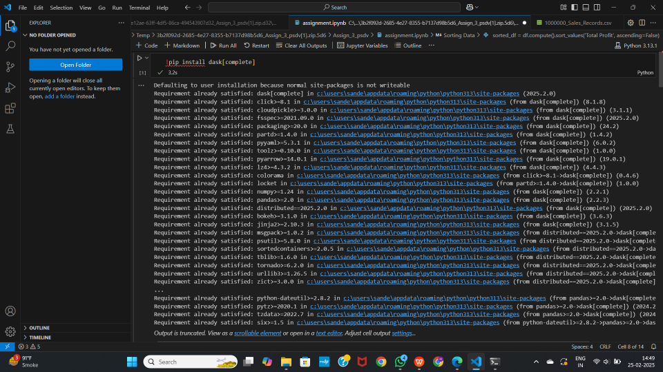
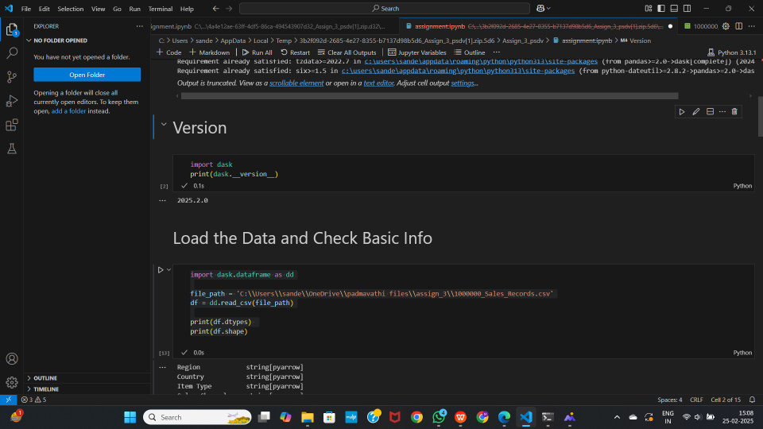
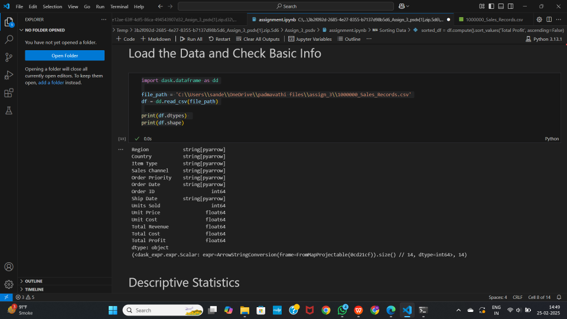
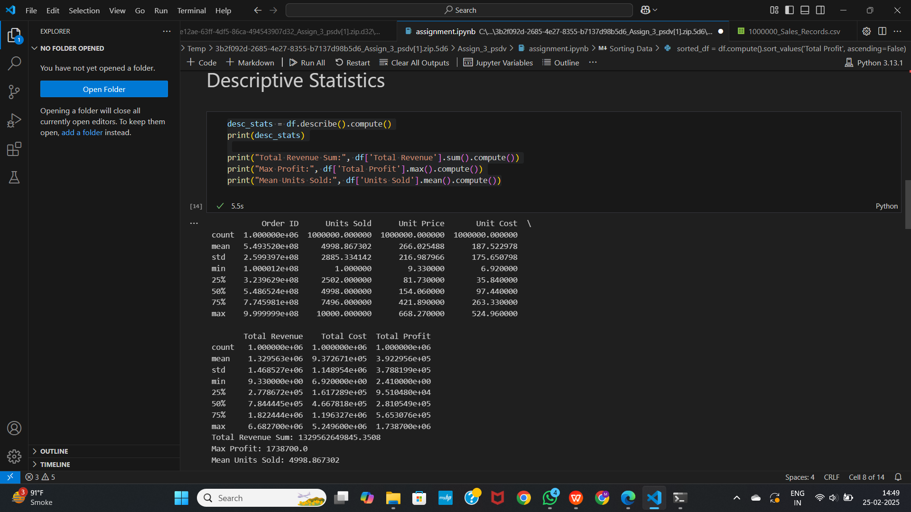
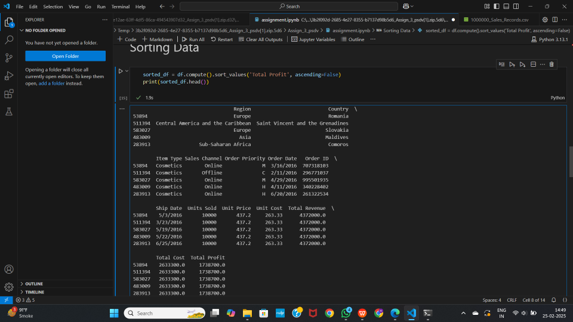
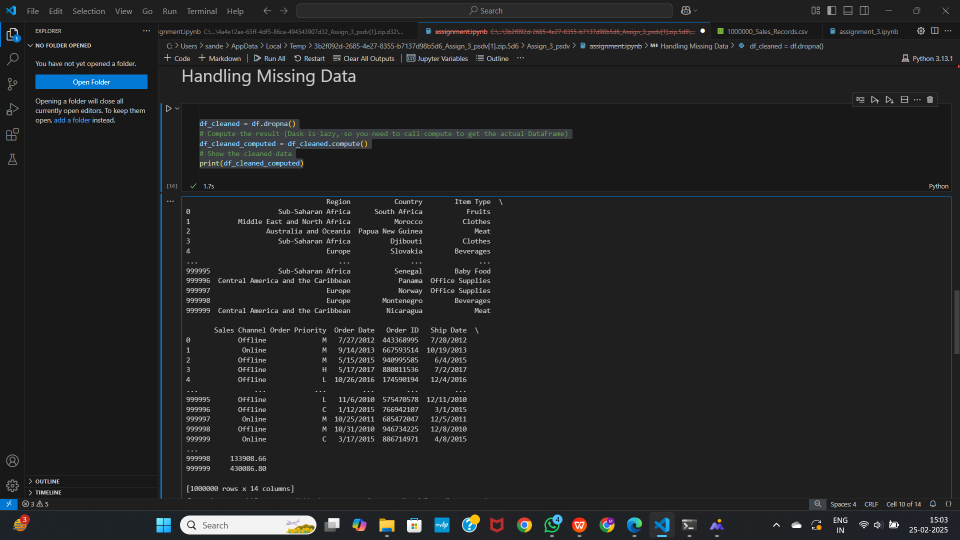
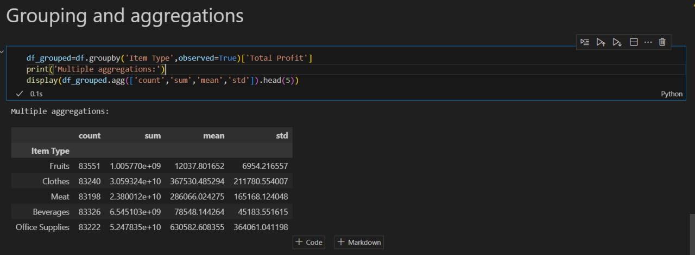

## Introduction

When working with datasets that exceed available memory, the standard Pandas workflow breaks down. Dask DataFrame addresses this limitation by partitioning large datasets into smaller, manageable chunks and processing them in parallel. It mirrors the Pandas API, so the learning curve is minimal for anyone already comfortable with Pandas.

This post walks through the installation process, highlights the key features of Dask DataFrame, and demonstrates its capabilities with practical code examples using a million-row sales dataset.

## Installation

Install Dask with all optional dependencies using the following command:

```python
pip install dask[complete]
```



To verify the installed version:

```python
import dask
print(dask.__version__)
```



## Key Features

### Parallel Computing

Dask splits data into smaller partitions and processes them in parallel across multiple CPU cores. For workloads that exceed a single machine's capacity, it can also scale out to distributed clusters.

### Out-of-Core Processing

Unlike Pandas, which loads entire datasets into memory at once, Dask processes data in chunks. This enables it to handle terabyte-scale datasets on machines with limited RAM.

### Multiple File Format Support

Dask can read and write data in several formats including CSV, Parquet, and SQL databases. It also integrates with cloud storage providers such as AWS S3, Google Cloud Storage, and Azure Blob Storage.

### Lazy Evaluation

Dask delays all computations until explicitly triggered by calling `.compute()`. This allows it to build an optimized task graph before executing, which reduces redundant work and minimizes memory usage.

### Task Scheduling and Monitoring

Dask includes a sophisticated task scheduler along with a real-time dashboard for monitoring computation progress, resource utilization, and performance bottlenecks.

### Integration with ML and Big Data Tools

Dask works alongside popular tools like Scikit-learn, XGBoost, CuDF (for GPU acceleration), and Apache Spark, making it suitable for advanced analytics pipelines.

## Code Examples

The examples below use a CSV file containing one million sales records.

### Loading Data and Inspecting Structure

```python
import dask.dataframe as dd

file_path = '1000000_Sales_Records.csv'
df = dd.read_csv(file_path)

# Display column data types (no computation needed)
print(df.dtypes)

# Display shape (triggers a lazy computation for row count)
print(df.shape)
```



Note that `dd.read_csv()` does not load the entire file into memory immediately. It reads just enough to infer the schema and defers the actual data loading until a computation is requested.

### Descriptive Statistics

```python
# Compute summary statistics across all numeric columns
desc_stats = df.describe().compute()
print(desc_stats)

# Individual aggregations
print("Total Revenue Sum:", df['Total Revenue'].sum().compute())
print("Max Profit:", df['Total Profit'].max().compute())
print("Mean Units Sold:", df['Units Sold'].mean().compute())
```



Each `.compute()` call triggers the actual calculation. Without it, Dask only records the operation in a task graph.

### Sorting Data

```python
# Sort by Total Profit in descending order
sorted_df = df.compute().sort_values('Total Profit', ascending=False)
print(sorted_df.head())
```



### Handling Missing Data

```python
# Drop rows containing any missing values
df_cleaned = df.dropna()
df_cleaned_computed = df_cleaned.compute()
print(df_cleaned_computed)
```



### Aggregation and Grouping

```python
# Group by 'Item Type' and aggregate Total Profit
df_grouped = df.groupby('Item Type', observed=True)['Total Profit']

print('Multiple aggregations:')
display(df_grouped.agg(['count', 'sum', 'mean', 'std']).head(5))
```



## Practical Use Cases

**Large-scale data analysis**: When datasets are too large to fit in memory, Dask partitions and processes them without requiring specialized hardware.

**Accelerating exploratory analysis**: By running operations in parallel across CPU cores, Dask significantly reduces the time spent on data exploration and profiling.

**Data preprocessing for machine learning**: Dask can handle the cleaning, transformation, and feature engineering steps on datasets that are too large for Pandas, before feeding the results into training frameworks like Scikit-learn or XGBoost.

**Streaming and real-time workloads**: Dask can process continuously arriving data, such as financial market feeds or IoT sensor streams, with low latency.

## Conclusion

Dask DataFrame is a practical tool for scaling Pandas-style data analysis beyond the limits of a single machine's memory. It preserves a familiar API while adding parallel execution, lazy evaluation, and cluster support. For projects that involve large datasets, whether in data science, machine learning pipelines, or production analytics, Dask provides a straightforward path from prototype to scale.

## References

- [Dask Official Documentation](https://docs.dask.org/en/stable/index.html)
- [Dask DataFrame API Reference](https://docs.dask.org/en/stable/dataframe-api.html)
- [Dask Tutorials (Project Pythia)](https://projectpythia.org/dask-cookbook/README.html)
- [Dask GitHub Repository](https://github.com/dask/dask)
